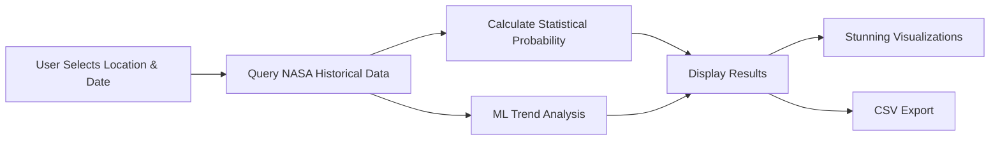

# Will It Rain On My Parade? 🌦️

**Historical Weather Probability Dashboard with ML Trend Analysis**

[](https://www.spaceappschallenge.org/)
[](https://react.dev/)
[](https://www.typescriptlang.org/)
[](https://www.python.org/)

> Plan your outdoor events with confidence using NASA satellite data and machine learning to understand not just historical weather odds, but whether those odds are changing over time.

---

## 📸 Screenshot


<!-- TODO: Replace with actual dashboard screenshot before submission -->

---

## 🚀 Quick Start

```bash
# Clone the repository
git clone https://github.com/NikaMikeltadze/random5.git
cd random5

# Install dependencies
npm install

# Start development server
npm run dev
```

Visit `http://localhost:5173` and start exploring weather probabilities!

---

## ✨ Features

### Dual-Layer Intelligence System

**📊 Statistical Baseline (Safety Net)**
- Historical probability calculations from 15+ years of NASA satellite data
- Simple, reliable: `count(extreme events) / total_years × 100%`
- Instant results for 5-10 preset demo locations

**🤖 ML Trend Analysis (Competitive Edge)**
- Prophet/scikit-learn models detecting probability changes over time
- Statistical significance testing (p-values)
- Answers: *"Is heavy rain becoming MORE likely in Seattle?"*
- Visualizes climate change impact on your specific event date

### User Experience
- 🗺️ **Interactive map** - Click anywhere or search locations
- 📅 **Date picker** - Select your event date with day-of-year analysis
- 🎨 **Stunning visualizations** - Histograms, trend lines, confidence intervals
- 🚦 **Color-coded risk levels** - Red (increasing risk), Yellow (stable), Green (decreasing)
- 💾 **CSV export** - Download full analysis with NASA citations
- ⚡ **Instant demo mode** - Preset locations with cached responses for flawless presentations

---

## 🛠️ Tech Stack

| Layer | Technology |
|-------|------------|
| **Frontend** | Vite + React 18 + TypeScript |
| **Styling** | Tailwind CSS + shadcn/ui components |
| **Charts** | Recharts (smooth trend lines & animations) |
| **Maps** | Leaflet.js |
| **ML/Analytics** | Python (Prophet, scikit-learn, pandas, NumPy) |
| **Backend** | Next.js API routes / FastAPI |
| **Deployment** | Vercel (with Python serverless functions) |

---

## 🛰️ NASA Data Sources

This project leverages official NASA and NOAA datasets:

- **[NASA MERRA-2](https://gmao.gsfc.nasa.gov/reanalysis/MERRA-2/)** - Modern-Era Retrospective analysis (1980-present) for long-term trend detection
- **[GPM IMERG](https://gpm.nasa.gov/data/imerg)** - Global Precipitation Measurement (2000-present)
- **[NASA GES DISC](https://disc.gsfc.nasa.gov/)** - Goddard Earth Sciences Data and Information Services Center
- **[NOAA GHCN-Daily](https://www.ncei.noaa.gov/products/land-based-station/global-historical-climatology-network-daily)** - Ground station validation data

All data properly cited in footer and CSV exports per NASA guidelines.

---

## 🧠 How It Works



1. **Input**: User selects location (map click/search) and target date
2. **Data Retrieval**: Query pre-processed NASA datasets (15-20+ years)
3. **Statistical Engine**: Calculate baseline probability of extreme events
4. **ML Engine**: Prophet time series model analyzes trends
   ```python
   # Simplified example
   yearly_probs = data.groupby('year').apply(lambda x: (x['temp'] > threshold).mean())
   model = Prophet().fit(yearly_probs)
   trend_slope = forecast['trend'].diff().mean()  # % change per year
   ```
5. **Visualization**: Historical scatter + ML trend line + confidence intervals
6. **Output**: Probability percentage + trend insight + risk level

---

## 📈 ML Approach

### Trend Detection Methodology
- **Algorithm**: Facebook Prophet for time series trend analysis
- **Input**: 15-20 years of daily weather observations → yearly probability aggregates
- **Output**: 
  - Trend line showing probability change (e.g., "+2.5% per decade")
  - Statistical significance (p-value < 0.05 = real trend)
  - Confidence intervals (80% and 95%)

### Feature Importance Analysis
```python
# Which weather variables predict extreme events?
RandomForestClassifier → Feature importances
Variables: temperature, humidity, pressure, wind speed
```

### Key Insight Display
> **Example**: "Heavy rain probability in Seattle has **INCREASED** from 28% (2005-2010) to 35% (2020-2025) — a statistically significant trend (p=0.007). Climate change in action."

---

## 🌍 Demo Locations (Instant Results)

Pre-processed datasets available for:

1. 🗽 **Central Park, NYC** - Urban outdoor events
2. 🌉 **Golden Gate Park, San Francisco** - Coastal weather patterns
3. 🏛️ **National Mall, Washington DC** - Summer festival planning
4. 🎬 **Griffith Observatory, Los Angeles** - Desert climate trends
5. 🌊 **Navy Pier, Chicago** - Great Lakes weather volatility
6. 🏔️ **Red Rocks Amphitheatre, Denver** - Mountain weather
7. 🎸 **Zilker Park, Austin** - Southern heat extremes
8. ⛰️ **Pike Place Market, Seattle** - Pacific Northwest rain analysis

*(Click any location for instant cached results during demo)*

---

## 👥 Team

**5-Person Interdisciplinary Team**
- 🖥️ **2 Computer Science Students** - Frontend & ML development
- ⚙️ **2 Engineers** - Data pipeline & backend systems
- 💼 **1 Business Lead** - User research, demo script, presentation

---

## 💻 Local Development

### Prerequisites
```bash
Node.js 18+
Python 3.9+ (for ML components)
npm or yarn
```

### Environment Setup
```bash
# Frontend
npm install
npm run dev

# ML Backend (if using Python)
cd ml-service
pip install -r requirements.txt
python app.py

# Environment variables (create .env.local)
VITE_MAP_API_KEY=your_map_key
NEXT_PUBLIC_API_URL=http://localhost:3000
```

### Project Structure
```
random5/
├── src/
│   ├── components/        # React components
│   ├── lib/               # Utilities, NASA data loaders
│   ├── ml/                # ML models (Prophet, sklearn)
│   └── data/              # Pre-processed JSON datasets
├── public/
│   └── demo-locations/    # Cached demo data
├── ml-service/            # Python ML backend (optional)
└── docs/                  # Screenshots, presentation
```

---

## 🎬 Demo Script Highlights

**Opening Hook** (30 seconds)
> "Planning outdoor events is risky. We built a tool using NASA data to show not just historical weather odds, but whether those odds are **changing**."

**Example 1** (60 seconds) - Seattle Wedding
- Input: Seattle, August 15th
- Statistical result: 28% historical rain chance
- **ML Insight**: Probability has **increased 3.2% per decade** → now ~35%
- Visual: Beautiful trend line showing upward trajectory

**Example 2** (60 seconds) - Arizona Desert Hike
- Input: Phoenix, July 4th
- Statistical result: 60% extreme heat historical occurrence
- **ML Insight**: Now **73%** — climate change visualized in real-time

**Example 3** (45 seconds) - Data Export
- Click "Download Analysis" → CSV with 15 years of data
- Includes: probabilities, trends, p-values, NASA citations

**Technical Highlight** (30 seconds)
> "Built with NASA MERRA-2 reanalysis, Prophet time series ML, React dashboard. Analyzed 15 years × 20 locations = 109,500 data points. All code open source."

---

## 🏆 Why This Wins

| Most Teams | Our Team |
|------------|----------|
| "Here's historical weather probability" ✅ | "Historical probability **+ how it's changing**" 🚀 |
| Meets requirements | **Exceeds requirements** |
| Shows past data | **Addresses urgent climate reality** |

**Key Differentiator**: We directly answer the challenge requirement:  
*"Estimate if the likelihood... have been **INCREASING**"*

This is our competitive edge: **Safety Net (statistics) + Reach (ML trends)**

---

## ⚡ Development Timeline

| Time | Milestone |
|------|-----------|
| **Day 1, 12 PM** | ✅ Statistical baseline working (SAFETY NET SECURED) |
| **Day 1, 6 PM** | ✅ ML trend detection on sample data OR pivot decision |
| **Day 2, 10 AM** | ⚠️ GO/NO-GO decision on ML integration |
| **Day 2, 4 PM** | 🎯 Final polish, demo rehearsal, video recording |

**Risk Management**: If ML not working by Day 2 10 AM → Cut it, polish baseline. Always have statistical fallback.

---

## 🔮 Future Enhancements

*Post-hackathon roadmap (not for 2-day sprint):*

- [ ] 100+ global locations with UNESCO World Heritage sites
- [ ] Additional weather variables (UV index, air quality, snowfall)
- [ ] Mobile-responsive PWA for event planners
- [ ] Real-time API integration (currently uses pre-processed data)
- [ ] User accounts to save favorite locations
- [ ] Integration with calendar apps (Google Calendar, Outlook)
- [ ] Webhook alerts when risk levels change

---

## 📜 License & Attribution

**License**: MIT License - see [LICENSE](LICENSE) file

**Data Attribution**:
- NASA MERRA-2 data provided by NASA Goddard Earth Sciences Data and Information Services Center (GES DISC)
- GPM IMERG data courtesy of NASA Precipitation Processing System (PPS)
- NOAA GHCN-Daily data from National Centers for Environmental Information (NCEI)

**Project**: Developed for NASA Space Apps Challenge 2025

---

## 🔗 Links

- 🌐 **Live Demo**: [https://random5.vercel.app](https://random5.vercel.app) *(update before submission)*
- 🎥 **Video Walkthrough**: [YouTube Link] *(record Day 2 PM)*
- 📊 **Presentation Slides**: [Google Slides] *(finalize Day 2)*
- 🏆 **Space Apps Project Page**: [Challenge Submission Link]

---

## 🤝 Contributing

This is a hackathon project completed in 48 hours. For questions or collaboration:

- **Issues**: Report bugs or suggest features via GitHub Issues
- **Team Contact**: [@NikaMikeltadze](https://github.com/NikaMikeltadze)

---

## 🙏 Acknowledgments

- NASA Space Apps Challenge organizers
- NASA GES DISC team for excellent data access tools
- Facebook Prophet and scikit-learn communities
- All hackathon mentors and judges

---

<div align="center">

**Built with 🛰️ NASA data, 🤖 Machine Learning, and ☕ lots of coffee in 48 hours**

*"Will it rain on my parade? Now you can know — with science."*

</div>
